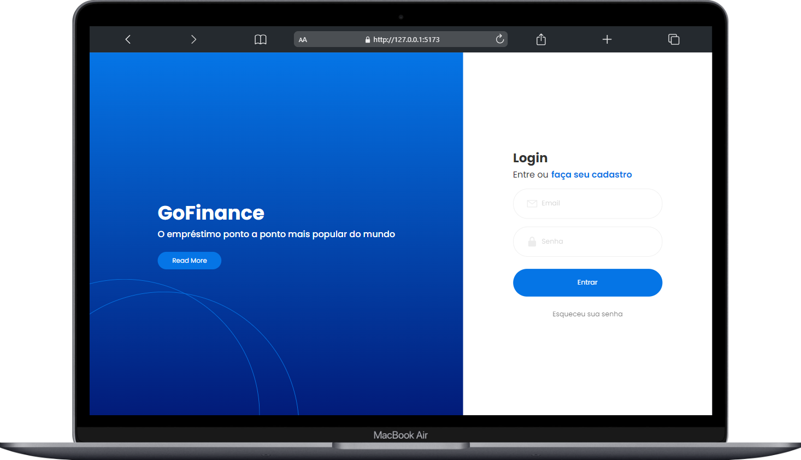
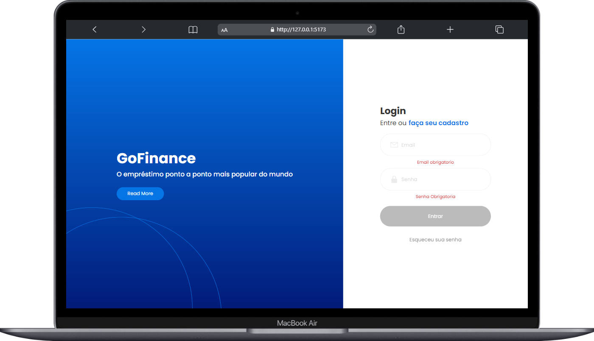
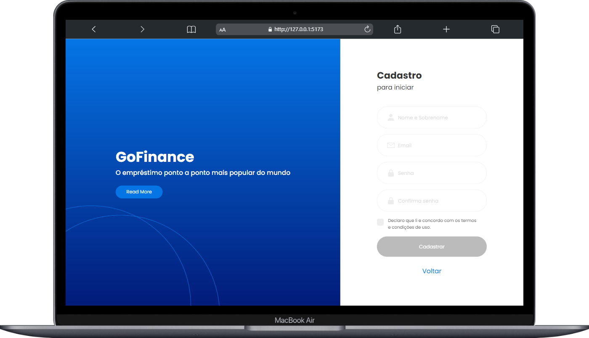
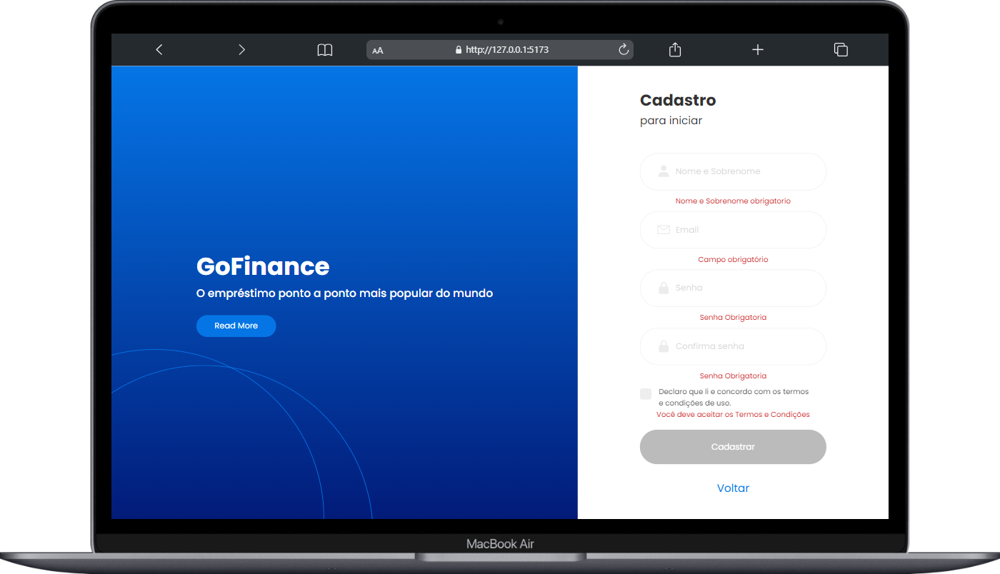
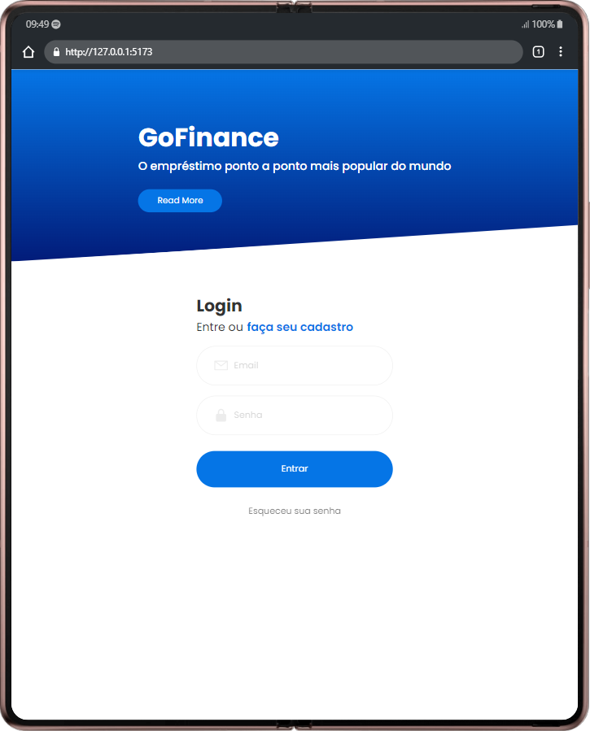
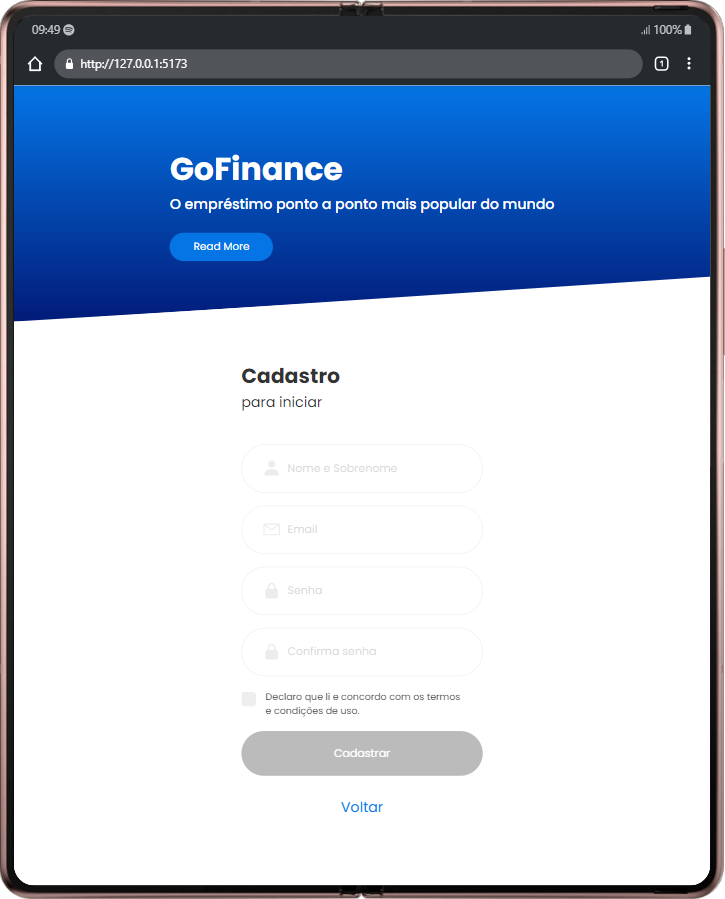
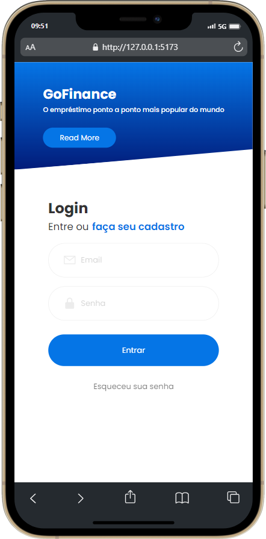
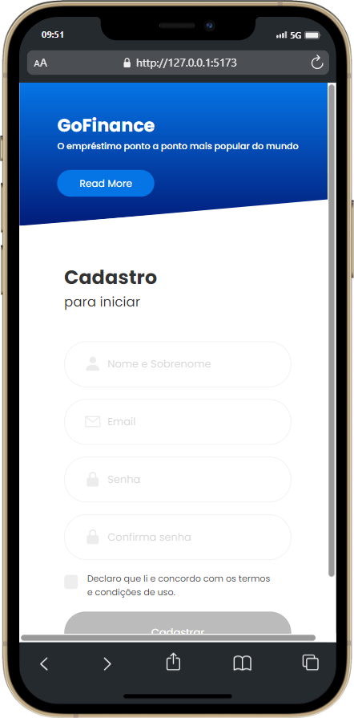

  
  <h1>Exercício Avaliativo Tela de Login / Cadastro</h1>

## 💡 **Proposta**

Exercício avaliativo da Raro Academy.  
Transformar uma tela de login e uma tela de cadastro que foi feita em HTML e CSS para React consumindo API!

## ✍️ **Processo**

      . Marcação semântica HTML5
      . Propriedades personalizadas de CSS3
      . Flexbox
      . React
      . TypeScript
      . Consumo de API
      . Design responsivo

## ⚙ **Funcionalidades**

      . Realizar cadastro em um formulário
      . Apos feito o cadastro deve enviar os dados para API
      . Realizar Login em um formulário
      . Buscar na API os dados do usuario cadastrado e efetuar login

## 😰 Desafios

      . Componentização  
      . Manipulação de API  
      . Gitflow  
      . Manipulação de rotas  
      . CSS  
      . Responsividade  

## 🖱️ **Aplicação**

#### Tela de login e cadastro desktop

  
  
   
   

#### Tela de login e cadastro tablet

      
  

#### Tela de login e cadastro mobile

  
  

  
## 🤖 Executando o projeto localmente
## Projeto iniciado usando Create React App.

- Clone o projeto com

> git clone https://git.raroacademy.com.br/kelvin.cruz/projeto-pratica-semana-06-gofinance.git

- Vá para a raiz do diretório

> cd projeto-pratica-semana-06-gofinance

- Instale as dependências

> npm install

- Inicie o servidor local

  > npm run dev

- Analisar erros padrões com ESLint

> npm run lint

## 👩‍💻 **Dev**

<table align="center">
    <tr>  
        <td align="center">
            

                 
                    <b> Kelvin Charles </b> 
                        
                        
            

        </td>
    </tr>
</table>
